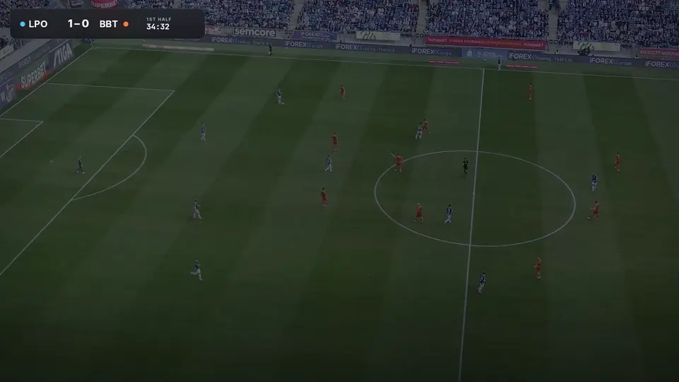

# TactiFoot Vision



TactiFoot Vision turns football match video into tactical data. It finds and follows every player and the ball, works out who plays for which team, and maps the action onto the pitch in metres.

- **Data:** load, convert, split and augment annotated football datasets.
- **Models:** train and evaluate YOLO, RF-DETR and pitch-keypoint models through one interface.
- **Pipeline:** detection, tracking, team classification and homography to pitch coordinates.
- **Output:** tracks, StatsBomb-style freeze frames, annotated video and a tactical radar.

## Quick start

```bash
uv sync
```

```python
import tactifoot_vision as tv

pipeline = tv.Pipeline(
    detector=tv.load_model("yolo", "models/football_yolo11m.pt"),
    keypoint_model=tv.load_model("yolo_pose", "models/pitch_yolov8n_pose.pt"),
    team_classifier=tv.teams.TeamClassifier("siglip"),
)
result = pipeline.run("match.mp4")
tv.viz.render_video(result, "match.mp4", "annotated.mp4")
```

The same pipeline runs from the command line:

```bash
tactifoot run configs/pipeline.yaml --video match.mp4 --output-dir outputs/match
```

## Learn more

- **[Notebooks](notebooks/README.md):** executed walkthroughs of every module, from data to visualisation. Start with `00_overview`.
- **[Architecture](docs/ARCHITECTURE.md):** modules, interfaces, run files and the CLI.
- **[Examples](examples/):** runnable scripts for each area and the CLI.
