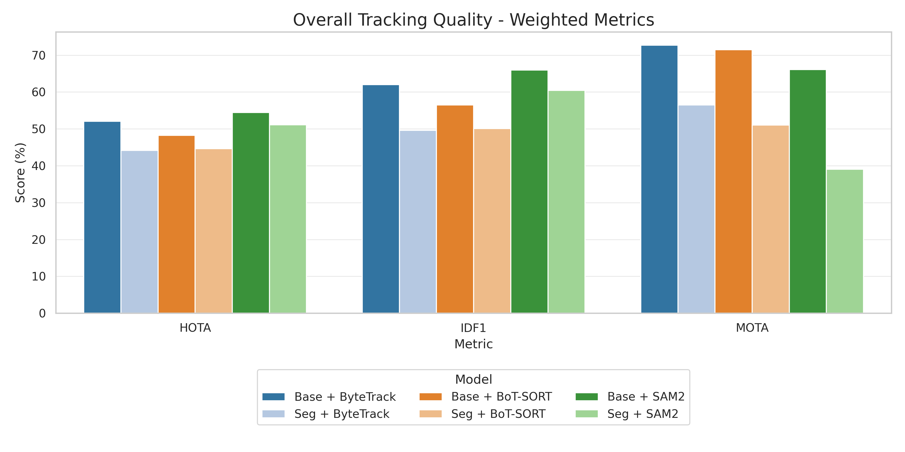
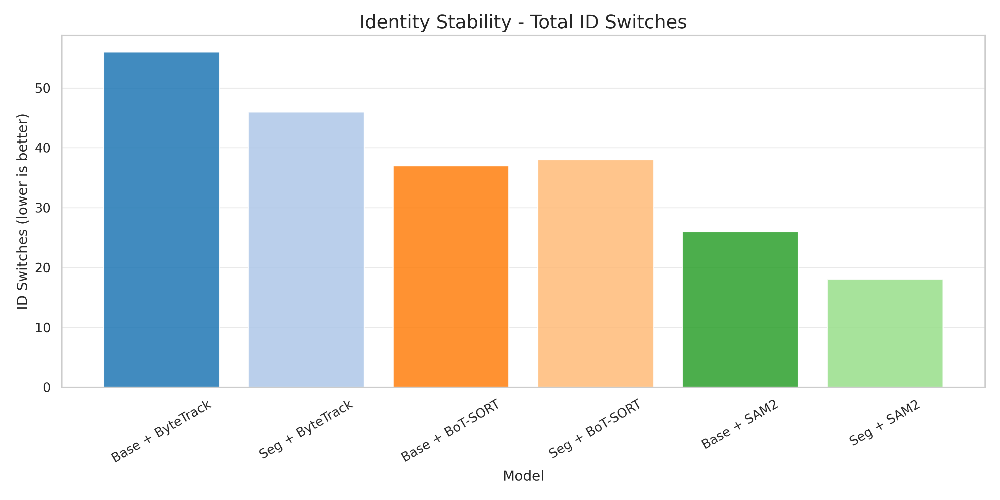
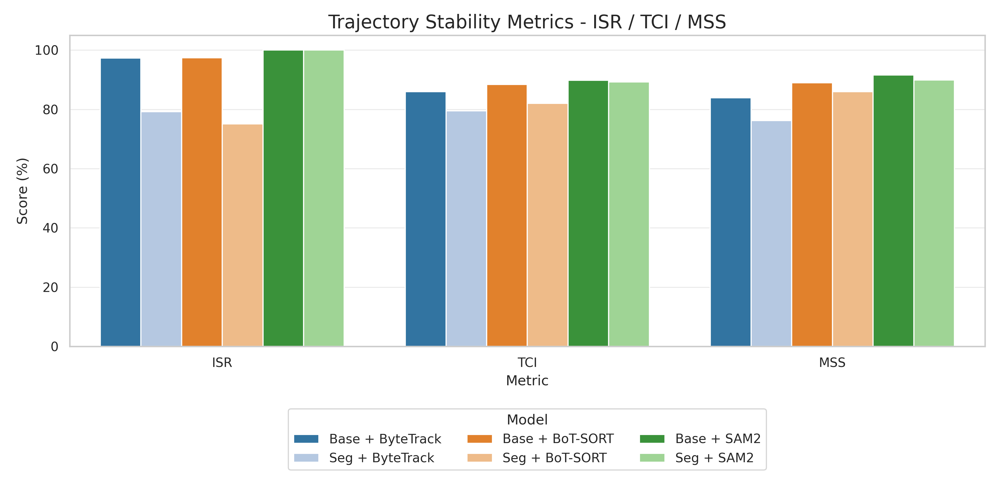
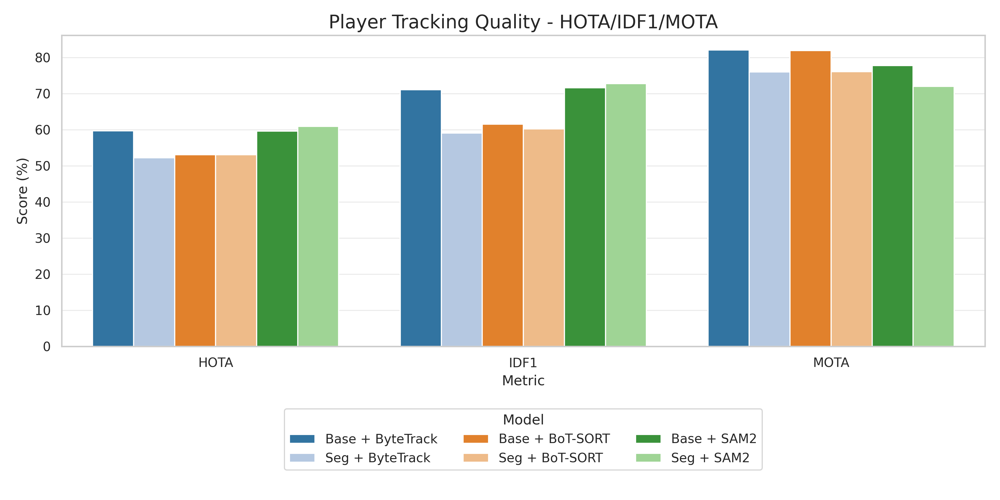
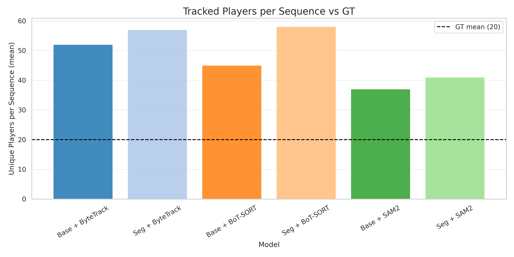

# Detekcja i Śledzenie Obiektów w Piłce Nożnej

**Główne hipotezy badawcze:**

1. **H1:** Śledzenie oparte na segmentacji wideo (SAM2) może osiągnąć konkurencyjne wyniki względem dedykowanych trackerów bbox przy odpowiedniej optymalizacji pipeline'u.
2. **H2:** Metryki standardowe (MOTA, IDF1, HOTA) nie wyczerpują oceny jakości śledzenia dla analizy taktycznej; potrzebne są dodatkowe metryki stabilności trajektorii.
3. **H3:** W praktyce istnieje napięcie między ciągłością trajektorii a fizyczną spójnością ruchu i należy je diagnozować metrykami ruchu.

---

## 1. Porównanie detektorów RF-DETR Base vs Segmentation

Eksperyment porównuje dwa warianty detektora RF-DETR w połączeniu z trzema trackerami.

| Wariant | HOTA | IDF1 | MOTA | ID-Switches |
|---------|------|------|------|-------------|
| **RF-DETR Base + ByteTrack** | **52.1** | **62.0** | **72.7** | 34.0 |
| RF-DETR Base + BoT-SORT | 48.3 | 56.5 | 71.5 | 23.8 |
| RF-DETR Base + SAM2 | 54.4 | 66.0 | 66.1 | **15.0** |
| RF-DETR Seg + ByteTrack | 44.2 | 49.6 | 56.5 | 32.5 |
| RF-DETR Seg + BoT-SORT | 44.6 | 50.1 | 51.1 | 28.2 |
| RF-DETR Seg + SAM2 | 51.1 | 60.5 | 39.1 | **12.2** |

*Tabela 1: Ważone metryki MOT (weighted) dla wszystkich klas na 5 sekwencjach testowych*

Na tym zbiorze RF-DETR Base jest stabilniejszym partnerem dla trackerów niż wariant Segmentation (różnica rzędu 7-10 p.p. HOTA). RF-DETR Seg generuje więcej FP (1057-1534 vs 725-1056), co obniża MOTA. Niezależnie od detektora, SAM2 osiąga najniższą liczbę ID-Switches.

---

## 2. Redukcja ID-Switches przez SAM2 (w analizowanej konfiguracji)

Na badanym zbiorze SAM2 redukuje liczbę zmian ID względem ByteTrack.

| Detektor | Tracker | ID-Switches | Redukcja vs ByteTrack |
|----------|---------|-------------|----------------------|
| RF-DETR Base | ByteTrack | 34.0 | - |
| RF-DETR Base | BoT-SORT | 23.8 | -30% |
| RF-DETR Base | **SAM2** | **15.0** | **-56%** |
| RF-DETR Seg | ByteTrack | 32.5 | - |
| RF-DETR Seg | BoT-SORT | 28.2 | -13% |
| RF-DETR Seg | **SAM2** | **12.2** | **-62%** |

W praktyce analizy taktycznej mniejsza liczba ID-Switches wspiera ciągłość historii zawodnika. Jednocześnie sama redukcja ID-Switches nie jest wystarczająca do twierdzenia o pełnej poprawności semantycznej tożsamości w każdej sytuacji boiskowej.

---

## 3. Metryki stabilności jako metryki proxy

Standardowe metryki MOT (MOTA, IDF1, HOTA) oceniają dopasowanie tracker-GT, ale nie opisują szczegółowo lokalnej dynamiki ruchu trajektorii. Dlatego wprowadzono dodatkowe metryki stabilności:

| Metryka | Opis | Zakres |
|---------|------|--------|
| **ISR** (Identity Stability Ratio) | Stosunek najdłuższego ciągłego segmentu do długości trajektorii | 0-1 (wyższy = lepsza ciągłość) |
| **ORC** (Occlusion Recovery Consistency) | Spójność pozycji po przerwach w obserwacji | 0-1 (wyższy = lepsza odporność na okluzje) |
| **DRR** (Direction Reversal Rate) | Częstość gwałtownych zmian kierunku (jitter) | 0-1 (niższy = stabilniejszy ruch) |
| **AOR** (Acceleration Outlier Rate) | Odsetek nietypowych przyspieszeń w trajektorii | 0-1 (niższy = stabilniejszy ruch) |
| **PPS** (Physical Plausibility Score) | Odsetek trajektorii zgodnych z ograniczeniami fizycznymi | 0-1 (wyższy = bardziej wiarygodny ruch) |
| **MSS** (Motion Smoothness Score) | Gładkość trajektorii na podstawie przyspieszenia | 0-1 (wyższy = płynniejszy ruch) |
| **TCI** (Trajectory Consistency Index) | Agregat ISR, ORC, DRR, AOR, PPS | 0-1 (wyższy = ogólnie lepsza jakość) |

### Zakres interpretacji (kluczowe rozróżnienie)

Powyższe wskaźniki należy traktować jako **metryki proxy**. Mierzą one stabilność, gładkość i fizyczną spójność zachowania przypisanego identyfikatora, ale **nie mierzą bezpośrednio poprawności semantycznej tożsamości zawodnika względem ground truth**.

Innymi słowy: wysoki wynik metryk proxy oznacza trajektorie bardziej regularne i mniej podatne na jitter, ale nie jest samodzielnym dowodem, że dany ID zawsze odpowiada temu samemu zawodnikowi w sensie semantycznym.

### TCVR vs DRR/AOR/PPS: rozszerzenie diagnostyczne

Na tym zbiorze metryka teleportacji TCVR okazała się zbyt gruboziarnista (niewiele zdarzeń przekraczających próg "teleportacji"), dlatego DRR/AOR/PPS wprowadzono jako **bardziej czułe, lokalne rozszerzenie diagnostyczne**, a nie bezpośredni zamiennik TCVR.

Brak teleportacji nie oznacza braku problemów: nawet bez dużych skoków pozycji mogą występować lokalne zaburzenia dynamiki (oscylacje kierunku, skoki przyspieszenia, krótkookresowy jitter), które DRR i AOR wykrywają skuteczniej niż metryka progowa TCVR.

---

## 4. Stabilność dynamiki trajektorii (DRR/AOR/PPS/MSS/TCI)

| Detektor | Tracker | ISR Mean | DRR | AOR | PPS | MSS Mean | TCI |
|----------|---------|----------|-----|-----|-----|----------|-----|
| RF-DETR Base | ByteTrack | 0.960 | 0.150 | 0.053 | 0.552 | 0.827 | 0.840 |
| RF-DETR Base | BoT-SORT | 0.961 | 0.067 | 0.031 | 0.633 | 0.879 | 0.880 |
| RF-DETR Base | SAM2 | **1.000** | **0.000** | 0.045 | **0.633** | **0.913** | **0.901** |
| RF-DETR Seg | ByteTrack | 0.793 | 0.138 | 0.041 | 0.523 | 0.762 | 0.795 |
| RF-DETR Seg | BoT-SORT | 0.751 | 0.045 | 0.042 | 0.592 | 0.860 | 0.820 |
| RF-DETR Seg | SAM2 | **1.000** | **0.000** | 0.041 | **0.593** | **0.899** | **0.892** |

W tej konfiguracji SAM2 osiąga ISR=1.0 i DRR=0.0 oraz najwyższe MSS i TCI. ByteTrack ma najwyższy DRR (0.138-0.150), co wskazuje na większy jitter. BoT-SORT pozostaje pośrodku.

### Ostrożna interpretacja wyników SAM2

1. Brak gwałtownych zmian kierunku i wysoka gładkość ruchu mogą być częściowo wzmacniane przez mechanizmy wygładzania i stabilizacji (m.in. `bbox_ema_alpha` oraz stitching tracków).
2. Wysoka stabilność trajektorii (ISR/DRR/MSS/TCI) nie jest równoważna gwarancji poprawności semantycznej tożsamości zawodnika.

Metryka MSS mierzy gładkość na podstawie przyspieszenia; po zastosowaniu EMA SAM2 osiąga najwyższy MSS (0.913 dla RF-DETR Base + SAM2). To należy czytać jako własność stabilności trajektorii, a nie autonomiczny dowód poprawności przypisania ID do konkretnej osoby.

*Wygładzanie EMA jest zintegrowane z trackerem SAM2 i może być konfigurowane przez parametr `bbox_ema_alpha`.*

### Konstrukcja TCI (uzasadnienie metodologiczne)

TCI agreguje ISR, ORC, DRR, AOR i PPS, aby połączyć pięć komplementarnych aspektów: ciągłość, odzyskanie po okluzji, stabilność kierunku, stabilność przyspieszenia i fizyczną wiarygodność.

Wzór:

`TCI = 0.25*ISR + 0.20*(1-DRR) + 0.15*(1-AOR) + 0.25*PPS + 0.15*ORC@30`

Komentarz metodologiczny:
- Do TCI włączono metryki, które opisują różne mechanizmy błędów i mają znormalizowany zakres 0-1.
- MSS pozostaje metryką raportowaną osobno (diagnostyka gładkości), aby nie dublować informacji o dynamice już częściowo reprezentowanej przez AOR/DRR.
- Wagi nie są równe; większy nacisk nadano ISR i PPS (po 0.25), czyli ciągłości i wiarygodności fizycznej. To decyzja projektowa, która premiuje spójność długoterminową i realizm ruchu.
- Konsekwencja: warianty z bardzo dobrą gładkością, ale słabszą ciągłością lub plausibility, nie osiągną wysokiego TCI.

---

## 5. Porównanie jakości śledzenia dla klasy "player"

Szczegółowa analiza klasy `player` pokazuje korzystne własności wariantu RF-DETR Base + SAM2 na badanym zbiorze:

| Wariant | HOTA (player) | IDF1 (player) | Liczba zawodników vs GT |
|---------|---------------|---------------|------------------------|
| RF-DETR Base + SAM2 | 54.4 | 66.0 | Najbliżej GT |
| RF-DETR Base + ByteTrack | 52.1 | 62.0 | Lekkie niedoszacowanie |
| RF-DETR Seg + SAM2 | 51.1 | 60.5 | Przeszacowanie (więcej FP) |

---

## 6. Ograniczenia i dalsza walidacja

1. Metryki ISR/ORC/DRR/AOR/PPS/MSS/TCI są metrykami proxy stabilności ruchu i nie zastępują walidacji semantycznej tożsamości na poziomie GT ID.
2. Wyniki należy interpretować jako obowiązujące dla analizowanego zbioru i konkretnej konfiguracji pipeline'u (w tym mechanizmów wygładzania/stitchingu).
3. TCI opiera się na założonych wagach; warto wykonać analizę wrażliwości na zmianę wag.
4. W kolejnych krokach wskazana jest walidacja na dodatkowych sekwencjach i raportowanie metryk tożsamościowych (np. IDF1/HOTA/AssA) równolegle z metrykami proxy.

---

## Podsumowanie weryfikacji hipotez

**H1: SAM2 może być konkurencyjny z tradycyjnymi trackerami**  
Na analizowanym zbiorze i w użytej konfiguracji SAM2 osiąga wysokie wyniki HOTA/IDF1 (dla RF-DETR Base: HOTA 54.4, IDF1 66.0) oraz wyraźnie mniej ID-Switches.

**H2: Potrzeba dodatkowych metryk**  
Metryki proxy (ISR, ORC, DRR, AOR, PPS, MSS, TCI) ujawniają różnice stabilności ruchu niewidoczne w samych metrykach MOT. Jednocześnie ich interpretacja musi pozostać rozdzielona od oceny semantycznej poprawności ID.

**H3: Ciągłość vs spójność ruchu**  
Na tym zbiorze nie obserwuje się silnych teleportacji, ale problemy ujawniają się na poziomie lokalnej dynamiki ruchu. W tej konfiguracji SAM2 wykazuje korzystne własności stabilności trajektorii, które nie są w pełni widoczne w klasycznych metrykach MOT.
